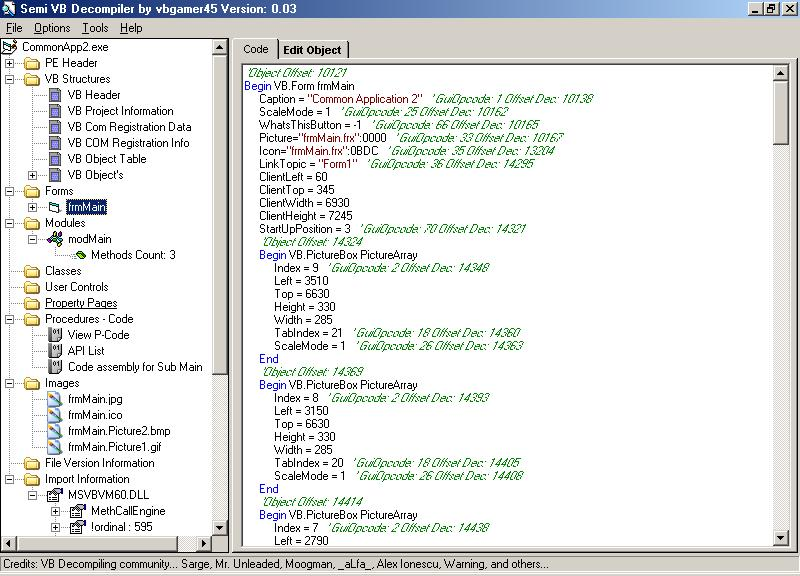

## Semi VB Decompiler 0\.03

### Description

Release 0.03

Added Ocx Support

Added P-Code procedure decompile to P-Code tokens.

Added Image Extraction

Added Better Handling of Control properties.

Added Form Patch Editor

Added Syntax Coloring.

Better support of User Controls/And MDI Forms.

Api's Recovered

Procedure Names recovered for Forms and classes.

Resizing of the windows added.

Numerous Bug fixes and other things added.

Begun work on a basic antidecompiler.

Features Advanced decompiling using COM via VB6.OLB

Using COM allows me not to have to hard code every single property

The only properties that need to be hardcoded is the size, font, and dataformat opcodes.

One day I hope to use msvbvm60.dll instead of vb6.olb so nothing will have to be hardcoded.

This is the best Open Source VB Decompiler you can find.

Show your support and leave comments and vote.
 
### More Info
 

             |
---                |---
**Submitted On**   |2004-08-31 23:18:40
**By**             |[vbgamer45](https://github.com/Planet-Source-Code/PSCIndex/blob/master/ByAuthor/vbgamer45.md)
**Level**          |Advanced
**User Rating**    |4.8 (157 globes from 33 users)
**Compatibility**  |VB 5\.0, VB 6\.0
**Category**       |[Miscellaneous](https://github.com/Planet-Source-Code/PSCIndex/blob/master/ByCategory/miscellaneous__1-1.md)
**World**          |[Visual Basic](https://github.com/Planet-Source-Code/PSCIndex/blob/master/ByWorld/visual-basic.md)
**Archive File**   |[Semi\_VB\_De178817912004\.zip](https://github.com/Planet-Source-Code/vbgamer45-semi-vb-decompiler-0-03__1-55935/archive/master.zip)

